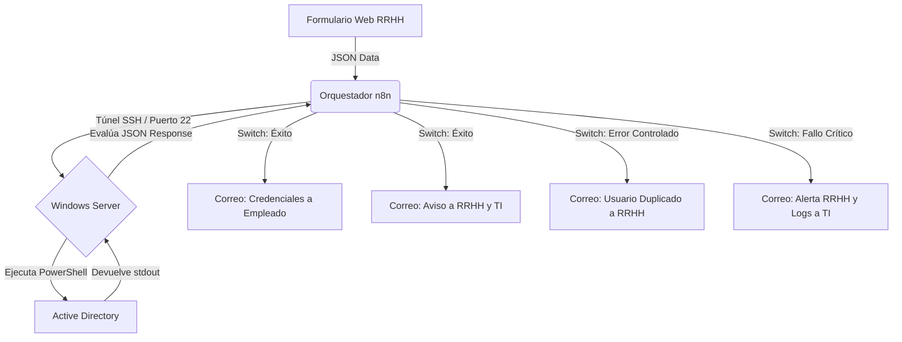

## 🚀Alta automatica de usuarios en Active Directory (n8n + PowerShell)]
Un flujo de trabajo completo que elimina la necesidad de crear usuarios manualmente en la consola de Active Directory. 

* **El Problema:** La creación manual de usuarios consume tiempo de TI, retrasa el *onboarding* de nuevos empleados y es propensa a errores tipográficos o asignaciones incorrectas de permisos.
* **La Solución:** Un orquestador web (n8n) captura los datos de Recursos Humanos mediante un formulario y ejecuta comandos de PowerShell a través de un túnel SSH directo al servidor Windows.
* **Características Clave:**
  * Generación dinámica de credenciales temporales seguras.
  * Limpieza de caracteres especiales (Tildes, letra Ñ).
  * Asignación automática de Grupos de Seguridad basada en el departamento.
  * Enrutamiento de errores y notificaciones automatizadas por SMTP.

## 🏗️ Arquitectura Lógica

## 🛠️ Stack Tecnológico Utilizado
Este proyecto combina herramientas nativas de Microsoft con orquestadores modernos:

* **Core:** Windows Server, Active Directory (AD DS).
* **Scripting:** PowerShell
* **Orquestación:** n8n

## 💡 Notas Adicionales y Adaptabilidad

* **Plantilla Base (Extensible):** Tanto el flujo exportado de n8n (`.json`) como el script de PowerShell (`.ps1`) están diseñados con una arquitectura modular. Siéntete libre de clonar este repositorio y adaptar el código a tu propia topología (por ejemplo, añadiendo sincronización con Google Workspace, Exchange u otros servicios posteriores).
* **Desarrollo Asistido por IA:** La arquitectura lógica, optimización de expresiones regulares (.NET) y estructuración de este proyecto han sido desarrollados con el apoyo y la asistencia de la inteligencia artificial de **Google Gemini**, actuando como copiloto de integración de sistemas.
