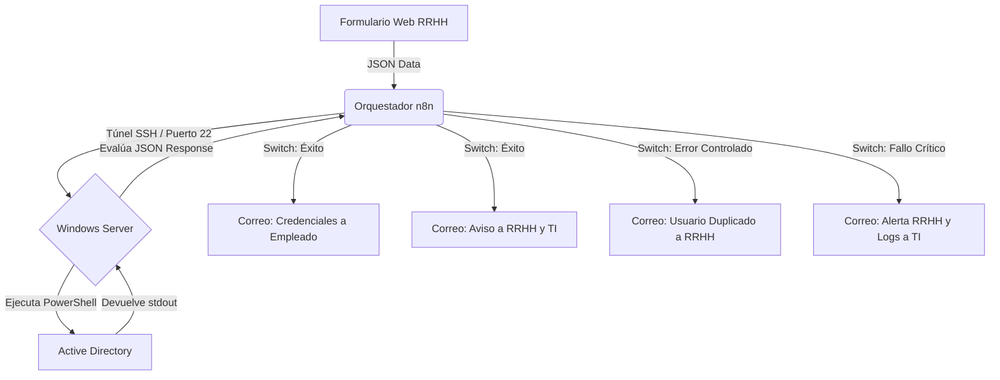

## 🚀Alta automatica de usuarios en Active Directory (n8n + PowerShell)]
Un flujo de trabajo completo que elimina la necesidad de crear usuarios manualmente en la consola de Active Directory. 

* **El Problema:** La creación manual de usuarios consume tiempo de TI, retrasa el *onboarding* de nuevos empleados y es propensa a errores tipográficos o asignaciones incorrectas de permisos.
* **La Solución:** Un orquestador web (n8n) captura los datos de Recursos Humanos mediante un formulario y ejecuta comandos de PowerShell a través de un túnel SSH directo al servidor Windows.
* **Características Clave:**
  * Generación dinámica de credenciales temporales seguras.
  * Limpieza de caracteres especiales (Tildes, letra Ñ).
  * Asignación automática de Grupos de Seguridad basada en el departamento.
  * Enrutamiento de errores y notificaciones automatizadas por SMTP.


## 🏗️ Arquitectura Lógica




## 📋 Requisitos Previos y Entorno

Para garantizar que la automatización funcione correctamente, la infraestructura debe cumplir con los siguientes requisitos técnicos mínimos:

### 1. Servidor de Destino (Windows Server)
* **Sistema Operativo:** Windows Server 2016, 2019 o 2022.
* **Motor de Scripting:** PowerShell 5.1 (nativo) o PowerShell 7+.
* **Dependencias:** Módulo `ActiveDirectory` instalado (herramientas RSAT).
* **Servicio SSH:** * OpenSSH Server instalado, habilitado y en ejecución.

  * **CRÍTICO:** Es obligatorio configurar PowerShell como la terminal por defecto para las sesiones SSH. Ejecuta este comando en el servidor destino (como Administrador) antes de lanzar el flujo:
  * 
    ```powershell
    New-ItemProperty -Path "HKLM:\SOFTWARE\OpenSSH" -Name DefaultShell -Value "C:\Windows\System32\WindowsPowerShell\v1.0\powershell.exe" -PropertyType String -Force
    ```

### 2. Red y Seguridad
* **Firewall:** Regla de entrada que permita tráfico por el **Puerto 22 (TCP)** desde la IP específica de la instancia de n8n.
* **Cuenta de Servicio (Least Privilege):** El script no debe ejecutarse como *Domain Admin*. Se requiere una cuenta de servicio delegada con permisos granulares exclusivamente para crear objetos de tipo *User* y modificar pertenencia a grupos en la OU de destino.

### 3. Orquestador (n8n)
* **Instancia:** n8n en versión Self-Hosted (Docker/LXC) o Cloud, siempre que tenga visibilidad de red hacia el servidor Windows.
* **Credenciales:** Configuración previa de credenciales SSH (preferiblemente mediante clave pública/privada RSA o ED25519) y credenciales SMTP para el envío de correos.


## 📖 Guía de Personalización 

Este proyecto está diseñado para ser clonado y adaptado rápidamente. Antes de ejecutarlo en tu entorno, revisa y modifica los siguientes parámetros:

### 1. Variables del Script (`crearUsuario.ps1`)
Abre el script y ajusta estas variables según tu topología de Directorio Activo:
* **Dominio:** En el comando `New-ADUser`, cambia la línea `-UserPrincipalName "$UsuarioLogin@empresa.local"` por el sufijo DNS real de tu dominio.
* **Grupos de Seguridad:** Localiza el bloque `switch ($NombreDepartamento)` y sustituye los nombres de los grupos (`G_Contabilidad`, `G_Informatica`, etc.) por los `sAMAccountName` exactos de tus grupos locales.
* **Ruta de Logs:** Asegúrate de que la ruta `C:\tmp\Errores_Grupos_AD.log` existe en el servidor donde se ejecutará el script, o cámbiala a la ruta estándar de logs.

### 2. Variables del Orquestador 
Una vez importado el flujo en tu instancia de n8n, la plataforma te pedirá reconfigurar los nodos de conexión:
* **Conexión SSH:** Actualiza la IP/Hostname del nodo para apuntar a tu Windows Server e introduce las credenciales de la cuenta de servicio autorizada.
* **Credenciales SMTP:** Configura el nodo *Send Email* con las credenciales de tu servidor de correo corporativo.
* **Buzones de Destino:** En los nodos finales de correo (tanto en la rama de éxito como en las de error), cambia las direcciones de los destinatarios para que apunten a los departamentos reales de RRHH y Soporte TI de tu organización.


## 🛠️ Stack Tecnológico Utilizado
Este proyecto combina herramientas nativas de Microsoft con orquestadores modernos:

* **Core:** Windows Server, Active Directory (AD DS).
* **Scripting:** PowerShell
* **Orquestación:** n8n


## 💡 Notas Adicionales y Adaptabilidad

* **Plantilla Base (Extensible):** Tanto el flujo exportado de n8n (`.json`) como el script de PowerShell (`.ps1`) están diseñados con una arquitectura modular. Siéntete libre de clonar este repositorio y adaptar el código a tu propia topología (por ejemplo, añadiendo sincronización con Google Workspace, Exchange u otros servicios posteriores).
* **Desarrollo Asistido por IA:** La arquitectura lógica, optimización de expresiones regulares (.NET) y estructuración de este proyecto han sido desarrollados con el apoyo y la asistencia de la inteligencia artificial de **Google Gemini**, actuando como copiloto de integración de sistemas.
