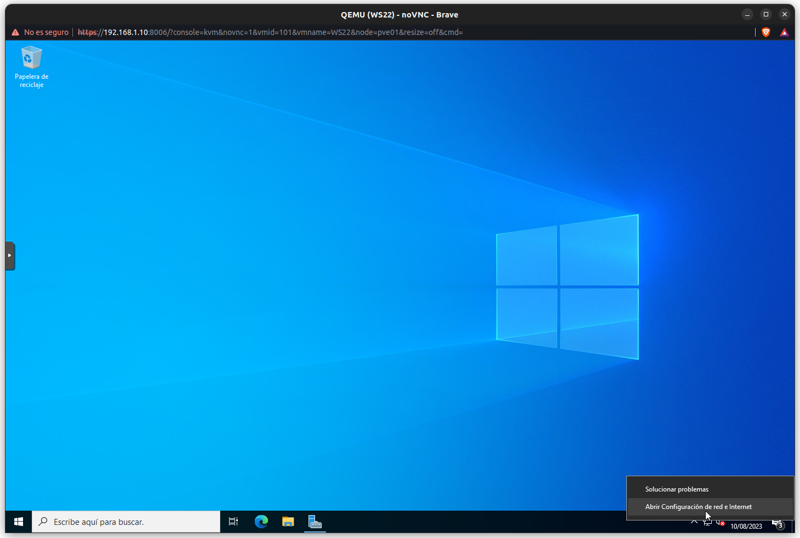

# Configuración inicial de WS2022

# 1.-Configuración de red (IPv4)

El primer paso cuando instalamos un WIndows Server es darle una IP estática para ellos seguimos los siguientes pasos:

1. Vamos a la ¨Configuracion de red” 
    
    
    
2. Buscamos el apartado ¨Cambiar opciones del adaptador¨
    
    
    
3. Nos situamos sobre la tarjeta de red de nuestro servidor y pulsamos con clic derecho, en el menu desplegado buscamos la opcion ¨Propiedades¨
    
    
    
4. En la nueva ventana buscamos la opción ¨Protocolo de Internet version 4 “y hacemos doble clic sobre ella. Aquí configuraremos la tarjeta la IP, puerta de enlace, DNS …
    
    
    
