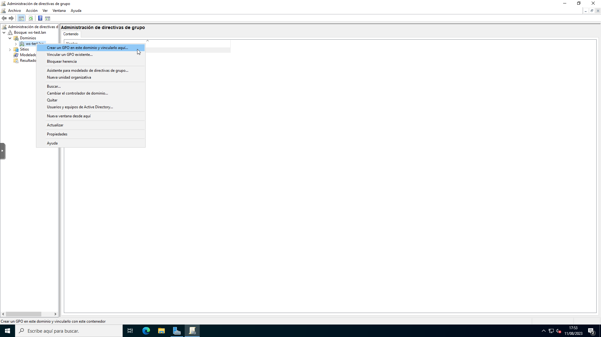

# Políticas de Grupo (GPO)

Owner: Pepe Alba
Date: August 12, 2023

<aside>
💡 Guía básica sobre las políticas de grupo mas utilizadas

</aside>

---

## Índice
1. [¿Cómo crear GPO?](#cómo-crear-gpo)
2. [Excluir grupo de usuarios (Admins) de la GPO](#excluir-grupo-de-usuarios-admins-de-la-gpo)
3. [Eliminar una unidad organizativa protegida](#eliminar-una-unidad-organizativa-protegida)
4. [GPO desde PowerShell](#gpo-desde-powershell)
---

# ¿Cómo crear GPO?

1. Nos dirigimos a Administrador del servidor > Herramientas > Administración de directivas de grupo 
2. Hacemos clic derecho sobre el dominio y seleccionamos “Crear un GPO en este dominio y vincularlo aquí”
    
    
    
3. Pulsamos sobre la nueva GPO y agregamos los grupos a los que se les aplicara las directivas (zona inferior) 
4. Sobre la nueva GPO hacemos  clic derecho y pulsamos en “Editar”
    
    
    

---

# Excluir grupo de usuarios (Admins) de la GPO

1. Dirigirnos a `“Administracion de directivas de grupo”` y pulsa sobre la GPO
2. En la pestaña `“Ambito”` buscamos `“Filtrado de seguridad”` y buscamos el grupo que queremos excluir de la GPO (en este caso, añadimos Admins. del dominio)
3. Luego vamos a la pestaña `¨Delegacion¨,` buscamos `Opciones Avanzadas` y pulsamos
4. En la nueva ventana seleccionamos `Admins. del dominio` y buscamos en `“Permisos de … “`  : `Aplicar directiva de Grupo` y marcamos la opcion `“Denegar”`
5. Pulsamos `“Aplicar”`  y `“Aceptar”` 

---

# Eliminar una unidad organizativa protegida

[Eliminar una unidad organizativa en la interfaz gráfica de Windows Server 2016 - SomeBooks.es](http://somebooks.es/eliminar-una-unidad-organizativa-la-interfaz-grafica-windows-server-2016/)

---

# GPO desde PowerShell

Inicialmente para poder trabajar con GPO desde la consola desde PowerShell deberemos de importar el modulo de Active Directory y GroupPolicy. Para comprobar si los tenemos importados utilizaremos el comando :

```powershell
Get-Module

ModuleType Version    Name                                ExportedCommands                                                                                                                                                           
---------- -------    ----                                ----------------                                                                                                                                                           
Manifest   1.0.1.0    ActiveDirectory                     {Add-ADCentralAccessPolicyMember, Add-ADComputerServiceAccount, Add-ADDomainControllerPasswordReplicationPolicy, Add-ADFineGrainedPasswordPolicySubject...}                
Manifest   1.0.0.0    GroupPolicy                         {Backup-GPO, Copy-GPO, Get-GPInheritance, Get-GPO...}                                                                                                                      
Script     1.0.0.0    ISE                                 {Get-IseSnippet, Import-IseSnippet, New-IseSnippet}                                                                                                                        
Manifest   3.1.0.0    Microsoft.PowerShell.Management     {Add-Computer, Add-Content, Checkpoint-Computer, Clear-Content...}                                                                                                         
Manifest   3.1.0.0    Microsoft.PowerShell.Utility        {Add-Member, Add-Type, Clear-Variable, Compare-Object...}                                                                                                                  

```

Si en la salida del comando no aparece alguno de los módulos necesarios podemos impórtalo con el siguiente comando:

```powershell
Import-Module ActiveDirectory
Import-Module GroupPolic
```

Una vez importados, si queremos tener una idea general de que opciones vamos a tener con estos módulos podemos ejecutar el siguiente comando: 

```powershell
Get-Command -Module GroupPolicy,ActiveDirectory

CommandType     Name                                               Version    Source                                                                                                                                                 
-----------     ----                                               -------    ------                                                                                                                                                 
Alias           Get-GPPermissions                                  1.0.0.0    GroupPolicy                                                                                                                                            
Alias           Set-GPPermissions                                  1.0.0.0    GroupPolicy                                                                                                                                            
Cmdlet          Add-ADCentralAccessPolicyMember                    1.0.1.0    ActiveDirectory                                                                                                                                        
Cmdlet          Add-ADComputerServiceAccount                       1.0.1.0    ActiveDirectory                                                                                                                                        
Cmdlet          Add-ADDomainControllerPasswordReplicationPolicy    1.0.1.0    ActiveDirectory                                                                                                                                        
Cmdlet          Add-ADFineGrainedPasswordPolicySubject             1.0.1.0    ActiveDirectory                                                                                                                                        
Cmdlet          Add-ADGroupMember                                  1.0.1.0    ActiveDirectory                                                                                                                                        
Cmdlet          Add-ADPrincipalGroupMembership                     1.0.1.0    ActiveDirectory                                                                                                                                        
Cmdlet          Add-ADResourcePropertyListMember                   1.0.1.0    ActiveDirectory                                                                                                                                        
Cmdlet          Backup-GPO                                         1.0.0.0    GroupPolicy                                                                                                                                            
Cmdlet          Clear-ADAccountExpiration                          1.0.1.0    ActiveDirectory                                                                                                                                        
Cmdlet          Clear-ADClaimTransformLink                         1.0.1.0    ActiveDirectory                                                                                                                                        
Cmdlet          Copy-GPO                                           1.0.0.0    GroupPolicy                                                                                                                                            
Cmdlet          Disable-ADAccount                                  1.0.1.0    ActiveDirectory                                                                                                                                        
Cmdlet          Disable-ADOptionalFeature                          1.0.1.0    ActiveDirectory                                                                                                                                        
Cmdlet          Enable-ADAccount                                   1.0.1.0    ActiveDirectory                                                                                                                                        
Cmdlet          Enable-ADOptionalFeature                           1.0.1.0    ActiveDirectory                                                                                                                                        
Cmdlet          Get-ADAccountAuthorizationGroup                    1.0.1.0    ActiveDirectory                                                                                                                                        
Cmdlet          Get-ADAccountResultantPasswordReplicationPolicy    1.0.1.0    ActiveDirectory                                                                                                                                        
Cmdlet          Get-ADAuthenticationPolicy                         1.0.1.0    ActiveDirectory                                                                                                                                        
Cmdlet          Get-ADAuthenticationPolicySilo                     1.0.1.0    ActiveDirectory                                                                                                                                        
Cmdlet          Get-ADCentralAccessPolicy                          1.0.1.0    ActiveDirectory                                                                                                                                        
Cmdlet          Get-ADCentralAccessRule                            1.0.1.0    ActiveDirectory                                                                                                                                        
Cmdlet          Get-ADClaimTransformPolicy                         1.0.1.0    ActiveDirectory                                                                                                                                        
Cmdlet          Get-ADClaimType                                    1.0.1.0    ActiveDirectory                                                                                                                                        
Cmdlet          Get-ADComputer                                     1.0.1.0    ActiveDirectory                                                                                                                                        
Cmdlet          Get-ADComputerServiceAccount                       1.0.1.0    ActiveDirectory                                                                                                                                        
Cmdlet          Get-ADDCCloningExcludedApplicationList             1.0.1.0    ActiveDirectory                                                                                                                                        
Cmdlet          Get-ADDefaultDomainPasswordPolicy                  1.0.1.0    ActiveDirectory                                                                                                                                        
Cmdlet          Get-ADDomain                                       1.0.1.0    ActiveDirectory                                                                                                                                        
Cmdlet          Get-ADDomainController                             1.0.1.0    ActiveDirectory                                                                                                                                        
Cmdlet          Get-ADDomainControllerPasswordReplicationPolicy    1.0.1.0    ActiveDirectory                                                                                                                                        
Cmdlet          Get-ADDomainControllerPasswordReplicationPolicy... 1.0.1.0    ActiveDirectory                                                                                                                                        
Cmdlet          Get-ADFineGrainedPasswordPolicy                    1.0.1.0    ActiveDirectory                                                                                                                                        
Cmdlet          Get-ADFineGrainedPasswordPolicySubject             1.0.1.0    ActiveDirectory                                                                                                                                        
Cmdlet          Get-ADForest                                       1.0.1.0    ActiveDirectory                                                                                                                                        
Cmdlet          Get-ADGroup                                        1.0.1.0    ActiveDirectory                                                                                                                                        
Cmdlet          Get-ADGroupMember                                  1.0.1.0    ActiveDirectory                                                                                                                                        
Cmdlet          Get-ADObject                                       1.0.1.0    ActiveDirectory                                                                                                                                        
Cmdlet          Get-ADOptionalFeature                              1.0.1.0    ActiveDirectory                                                                                                                                        
Cmdlet          Get-ADOrganizationalUnit                           1.0.1.0    ActiveDirectory                                                                                                                                        
Cmdlet          Get-ADPrincipalGroupMembership                     1.0.1.0    ActiveDirectory                                                                                                                                        
Cmdlet          Get-ADReplicationAttributeMetadata                 1.0.1.0    ActiveDirectory                                                                                                                                        
Cmdlet          Get-ADReplicationConnection                        1.0.1.0    ActiveDirectory                                                                                                                                        
Cmdlet          Get-ADReplicationFailure                           1.0.1.0    ActiveDirectory                                                                                                                                        
Cmdlet          Get-ADReplicationPartnerMetadata                   1.0.1.0    ActiveDirectory                                                                                                                                        
Cmdlet          Get-ADReplicationQueueOperation                    1.0.1.0    ActiveDirectory                                                                                                                                        
Cmdlet          Get-ADReplicationSite                              1.0.1.0    ActiveDirectory                                                                                                                                        
Cmdlet          Get-ADReplicationSiteLink                          1.0.1.0    ActiveDirectory                                                                                                                                        
Cmdlet          Get-ADReplicationSiteLinkBridge                    1.0.1.0    ActiveDirectory                                                                                                                                        
Cmdlet          Get-ADReplicationSubnet                            1.0.1.0    ActiveDirectory                                                                                                                                        
Cmdlet          Get-ADReplicationUpToDatenessVectorTable           1.0.1.0    ActiveDirectory                                                                                                                                        
Cmdlet          Get-ADResourceProperty                             1.0.1.0    ActiveDirectory                                                                                                                                        
Cmdlet          Get-ADResourcePropertyList                         1.0.1.0    ActiveDirectory                                                                                                                                        
Cmdlet          Get-ADResourcePropertyValueType                    1.0.1.0    ActiveDirectory                                                                                                                                        
Cmdlet          Get-ADRootDSE                                      1.0.1.0    ActiveDirectory                                                                                                                                        
Cmdlet          Get-ADServiceAccount                               1.0.1.0    ActiveDirectory                                                                                                                                        
Cmdlet          Get-ADTrust                                        1.0.1.0    ActiveDirectory                                                                                                                                        
Cmdlet          Get-ADUser                                         1.0.1.0    ActiveDirectory                                                                                                                                        
Cmdlet          Get-ADUserResultantPasswordPolicy                  1.0.1.0    ActiveDirectory                                                                                                                                        
Cmdlet          Get-GPInheritance                                  1.0.0.0    GroupPolicy                                                                                                                                            
Cmdlet          Get-GPO                                            1.0.0.0    GroupPolicy                                                                                                                                            
Cmdlet          Get-GPOReport                                      1.0.0.0    GroupPolicy                                                                                                                                            
Cmdlet          Get-GPPermission                                   1.0.0.0    GroupPolicy                                                                                                                                            
Cmdlet          Get-GPPrefRegistryValue                            1.0.0.0    GroupPolicy                                                                                                                                            
Cmdlet          Get-GPRegistryValue                                1.0.0.0    GroupPolicy                                                                                                                                            
Cmdlet          Get-GPResultantSetOfPolicy                         1.0.0.0    GroupPolicy                                                                                                                                            
Cmdlet          Get-GPStarterGPO                                   1.0.0.0    GroupPolicy                                                                                                                                            
Cmdlet          Grant-ADAuthenticationPolicySiloAccess             1.0.1.0    ActiveDirectory                                                                                                                                        
Cmdlet          Import-GPO                                         1.0.0.0    GroupPolicy                                                                                                                                            
Cmdlet          Install-ADServiceAccount                           1.0.1.0    ActiveDirectory                                                                                                                                        
Cmdlet          Invoke-GPUpdate                                    1.0.0.0    GroupPolicy                                                                                                                                            
Cmdlet          Move-ADDirectoryServer                             1.0.1.0    ActiveDirectory                                                                                                                                        
Cmdlet          Move-ADDirectoryServerOperationMasterRole          1.0.1.0    ActiveDirectory                                                                                                                                        
Cmdlet          Move-ADObject                                      1.0.1.0    ActiveDirectory                                                                                                                                        
Cmdlet          New-ADAuthenticationPolicy                         1.0.1.0    ActiveDirectory                                                                                                                                        
Cmdlet          New-ADAuthenticationPolicySilo                     1.0.1.0    ActiveDirectory                                                                                                                                        
Cmdlet          New-ADCentralAccessPolicy                          1.0.1.0    ActiveDirectory                                                                                                                                        
Cmdlet          New-ADCentralAccessRule                            1.0.1.0    ActiveDirectory                                                                                                                                        
Cmdlet          New-ADClaimTransformPolicy                         1.0.1.0    ActiveDirectory                                                                                                                                        
Cmdlet          New-ADClaimType                                    1.0.1.0    ActiveDirectory                                                                                                                                        
Cmdlet          New-ADComputer                                     1.0.1.0    ActiveDirectory                                                                                                                                        
Cmdlet          New-ADDCCloneConfigFile                            1.0.1.0    ActiveDirectory                                                                                                                                        
Cmdlet          New-ADFineGrainedPasswordPolicy                    1.0.1.0    ActiveDirectory                                                                                                                                        
Cmdlet          New-ADGroup                                        1.0.1.0    ActiveDirectory                                                                                                                                        
Cmdlet          New-ADObject                                       1.0.1.0    ActiveDirectory                                                                                                                                        
Cmdlet          New-ADOrganizationalUnit                           1.0.1.0    ActiveDirectory                                                                                                                                        
Cmdlet          New-ADReplicationSite                              1.0.1.0    ActiveDirectory                                                                                                                                        
Cmdlet          New-ADReplicationSiteLink                          1.0.1.0    ActiveDirectory                                                                                                                                        
Cmdlet          New-ADReplicationSiteLinkBridge                    1.0.1.0    ActiveDirectory                                                                                                                                        
Cmdlet          New-ADReplicationSubnet                            1.0.1.0    ActiveDirectory                                                                                                                                        
Cmdlet          New-ADResourceProperty                             1.0.1.0    ActiveDirectory                                                                                                                                        
Cmdlet          New-ADResourcePropertyList                         1.0.1.0    ActiveDirectory                                                                                                                                        
Cmdlet          New-ADServiceAccount                               1.0.1.0    ActiveDirectory                                                                                                                                        
Cmdlet          New-ADUser                                         1.0.1.0    ActiveDirectory                                                                                                                                        
Cmdlet          New-GPLink                                         1.0.0.0    GroupPolicy                                                                                                                                            
Cmdlet          New-GPO                                            1.0.0.0    GroupPolicy                                                                                                                                            
Cmdlet          New-GPStarterGPO                                   1.0.0.0    GroupPolicy                                                                                                                                            
Cmdlet          Remove-ADAuthenticationPolicy                      1.0.1.0    ActiveDirectory                                                                                                                                        
Cmdlet          Remove-ADAuthenticationPolicySilo                  1.0.1.0    ActiveDirectory                                                                                                                                        
Cmdlet          Remove-ADCentralAccessPolicy                       1.0.1.0    ActiveDirectory                                                                                                                                        
Cmdlet          Remove-ADCentralAccessPolicyMember                 1.0.1.0    ActiveDirectory                                                                                                                                        
Cmdlet          Remove-ADCentralAccessRule                         1.0.1.0    ActiveDirectory                                                                                                                                        
Cmdlet          Remove-ADClaimTransformPolicy                      1.0.1.0    ActiveDirectory                                                                                                                                        
Cmdlet          Remove-ADClaimType                                 1.0.1.0    ActiveDirectory                                                                                                                                        
Cmdlet          Remove-ADComputer                                  1.0.1.0    ActiveDirectory                                                                                                                                        
Cmdlet          Remove-ADComputerServiceAccount                    1.0.1.0    ActiveDirectory                                                                                                                                        
Cmdlet          Remove-ADDomainControllerPasswordReplicationPolicy 1.0.1.0    ActiveDirectory                                                                                                                                        
Cmdlet          Remove-ADFineGrainedPasswordPolicy                 1.0.1.0    ActiveDirectory                                                                                                                                        
Cmdlet          Remove-ADFineGrainedPasswordPolicySubject          1.0.1.0    ActiveDirectory                                                                                                                                        
Cmdlet          Remove-ADGroup                                     1.0.1.0    ActiveDirectory                                                                                                                                        
Cmdlet          Remove-ADGroupMember                               1.0.1.0    ActiveDirectory                                                                                                                                        
Cmdlet          Remove-ADObject                                    1.0.1.0    ActiveDirectory                                                                                                                                        
Cmdlet          Remove-ADOrganizationalUnit                        1.0.1.0    ActiveDirectory                                                                                                                                        
Cmdlet          Remove-ADPrincipalGroupMembership                  1.0.1.0    ActiveDirectory                                                                                                                                        
Cmdlet          Remove-ADReplicationSite                           1.0.1.0    ActiveDirectory                                                                                                                                        
Cmdlet          Remove-ADReplicationSiteLink                       1.0.1.0    ActiveDirectory                                                                                                                                        
Cmdlet          Remove-ADReplicationSiteLinkBridge                 1.0.1.0    ActiveDirectory                                                                                                                                        
Cmdlet          Remove-ADReplicationSubnet                         1.0.1.0    ActiveDirectory                                                                                                                                        
Cmdlet          Remove-ADResourceProperty                          1.0.1.0    ActiveDirectory                                                                                                                                        
Cmdlet          Remove-ADResourcePropertyList                      1.0.1.0    ActiveDirectory                                                                                                                                        
Cmdlet          Remove-ADResourcePropertyListMember                1.0.1.0    ActiveDirectory                                                                                                                                        
Cmdlet          Remove-ADServiceAccount                            1.0.1.0    ActiveDirectory                                                                                                                                        
Cmdlet          Remove-ADUser                                      1.0.1.0    ActiveDirectory                                                                                                                                        
Cmdlet          Remove-GPLink                                      1.0.0.0    GroupPolicy                                                                                                                                            
Cmdlet          Remove-GPO                                         1.0.0.0    GroupPolicy                                                                                                                                            
Cmdlet          Remove-GPPrefRegistryValue                         1.0.0.0    GroupPolicy                                                                                                                                            
Cmdlet          Remove-GPRegistryValue                             1.0.0.0    GroupPolicy                                                                                                                                            
Cmdlet          Rename-ADObject                                    1.0.1.0    ActiveDirectory                                                                                                                                        
Cmdlet          Rename-GPO                                         1.0.0.0    GroupPolicy                                                                                                                                            
Cmdlet          Reset-ADServiceAccountPassword                     1.0.1.0    ActiveDirectory                                                                                                                                        
Cmdlet          Restore-ADObject                                   1.0.1.0    ActiveDirectory                                                                                                                                        
Cmdlet          Restore-GPO                                        1.0.0.0    GroupPolicy                                                                                                                                            
Cmdlet          Revoke-ADAuthenticationPolicySiloAccess            1.0.1.0    ActiveDirectory                                                                                                                                        
Cmdlet          Search-ADAccount                                   1.0.1.0    ActiveDirectory                                                                                                                                        
Cmdlet          Set-ADAccountAuthenticationPolicySilo              1.0.1.0    ActiveDirectory                                                                                                                                        
Cmdlet          Set-ADAccountControl                               1.0.1.0    ActiveDirectory                                                                                                                                        
Cmdlet          Set-ADAccountExpiration                            1.0.1.0    ActiveDirectory                                                                                                                                        
Cmdlet          Set-ADAccountPassword                              1.0.1.0    ActiveDirectory                                                                                                                                        
Cmdlet          Set-ADAuthenticationPolicy                         1.0.1.0    ActiveDirectory                                                                                                                                        
Cmdlet          Set-ADAuthenticationPolicySilo                     1.0.1.0    ActiveDirectory                                                                                                                                        
Cmdlet          Set-ADCentralAccessPolicy                          1.0.1.0    ActiveDirectory                                                                                                                                        
Cmdlet          Set-ADCentralAccessRule                            1.0.1.0    ActiveDirectory                                                                                                                                        
Cmdlet          Set-ADClaimTransformLink                           1.0.1.0    ActiveDirectory                                                                                                                                        
Cmdlet          Set-ADClaimTransformPolicy                         1.0.1.0    ActiveDirectory                                                                                                                                        
Cmdlet          Set-ADClaimType                                    1.0.1.0    ActiveDirectory                                                                                                                                        
Cmdlet          Set-ADComputer                                     1.0.1.0    ActiveDirectory                                                                                                                                        
Cmdlet          Set-ADDefaultDomainPasswordPolicy                  1.0.1.0    ActiveDirectory                                                                                                                                        
Cmdlet          Set-ADDomain                                       1.0.1.0    ActiveDirectory                                                                                                                                        
Cmdlet          Set-ADDomainMode                                   1.0.1.0    ActiveDirectory                                                                                                                                        
Cmdlet          Set-ADFineGrainedPasswordPolicy                    1.0.1.0    ActiveDirectory                                                                                                                                        
Cmdlet          Set-ADForest                                       1.0.1.0    ActiveDirectory                                                                                                                                        
Cmdlet          Set-ADForestMode                                   1.0.1.0    ActiveDirectory                                                                                                                                        
Cmdlet          Set-ADGroup                                        1.0.1.0    ActiveDirectory                                                                                                                                        
Cmdlet          Set-ADObject                                       1.0.1.0    ActiveDirectory                                                                                                                                        
Cmdlet          Set-ADOrganizationalUnit                           1.0.1.0    ActiveDirectory                                                                                                                                        
Cmdlet          Set-ADReplicationConnection                        1.0.1.0    ActiveDirectory                                                                                                                                        
Cmdlet          Set-ADReplicationSite                              1.0.1.0    ActiveDirectory                                                                                                                                        
Cmdlet          Set-ADReplicationSiteLink                          1.0.1.0    ActiveDirectory                                                                                                                                        
Cmdlet          Set-ADReplicationSiteLinkBridge                    1.0.1.0    ActiveDirectory                                                                                                                                        
Cmdlet          Set-ADReplicationSubnet                            1.0.1.0    ActiveDirectory                                                                                                                                        
Cmdlet          Set-ADResourceProperty                             1.0.1.0    ActiveDirectory                                                                                                                                        
Cmdlet          Set-ADResourcePropertyList                         1.0.1.0    ActiveDirectory                                                                                                                                        
Cmdlet          Set-ADServiceAccount                               1.0.1.0    ActiveDirectory                                                                                                                                        
Cmdlet          Set-ADUser                                         1.0.1.0    ActiveDirectory                                                                                                                                        
Cmdlet          Set-GPInheritance                                  1.0.0.0    GroupPolicy                                                                                                                                            
Cmdlet          Set-GPLink                                         1.0.0.0    GroupPolicy                                                                                                                                            
Cmdlet          Set-GPPermission                                   1.0.0.0    GroupPolicy                                                                                                                                            
Cmdlet          Set-GPPrefRegistryValue                            1.0.0.0    GroupPolicy                                                                                                                                            
Cmdlet          Set-GPRegistryValue                                1.0.0.0    GroupPolicy                                                                                                                                            
Cmdlet          Show-ADAuthenticationPolicyExpression              1.0.1.0    ActiveDirectory                                                                                                                                        
Cmdlet          Sync-ADObject                                      1.0.1.0    ActiveDirectory                                                                                                                                        
Cmdlet          Test-ADServiceAccount                              1.0.1.0    ActiveDirectory                                                                                                                                        
Cmdlet          Uninstall-ADServiceAccount                         1.0.1.0    ActiveDirectory                                                                                                                                        
Cmdlet          Unlock-ADAccount                                   1.0.1.0    ActiveDirectory         
```

### Crear una GPO

Para la creación de la GPO usaremos el siguiente comando donde indicaremos el nombre de la GPO, una descripción y el dominio donde queremos aplicarlo. 

```powershell
New-GPO -Name test_GPO -Comment "Esta es una GPO de prueba" -Domain ws22-ad.local 
```

De esta forma hemos creado una GPO, pero supongamos que queremos crear un GPO vinculada a una OU especifica. En ese caso, usaremos el comando anterior concatenado con otro mas, donde deberemos indicar la OU/Objeto al que va ir vinculado: 

```powershell
New-GPO -Name test_GPO -Comment "Esta es una GPO de prueba" | New-GPLink -Target "OU=Alumnos,OU=FP,OU=Colegio,DC=ws22-ad,DC=local"

GpoId       : 8255e8e0-a4ae-4b15-af6a-e66bb3495d9e
DisplayName : test_GPO
Enabled     : True
Enforced    : False
Target      : OU=Alumnos,OU=FP,OU=Colegio,DC=ws22-ad,DC=local
Order       : 1

```
